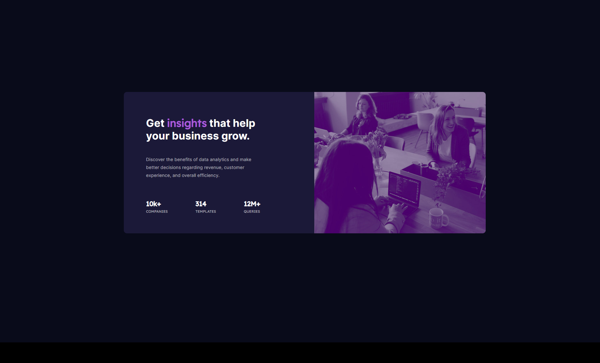

# FrontEnd Mentor - Stats Preview Card Component

This is the solution to the challenge [Stats Preview Card Component](https://www.frontendmentor.io/challenges/stats-preview-card-component-8JqbgoU62) on the site [FrontEnd Mentor](https://www.frontendmentor.io)

## Table of Content

- [Overview](#overview)
  - [What is the challenge ?](#what-is-the-challenge)
  - [Screenshot](#screenshot)
  - [Links](#links)
- [How I made this ?](#how-i-made-this)
  - [Languages used](#languages-used)
  - [Ressources that help me](#ressources-that-help-me)

## Overview

### What is the challenge ?

In this challenge you should build out a card component and get it looking as close to the design as possible.

### Screenshot

### Links

- Solution URL: <https://www.frontendmentor.io/solutions/stats-preview-card-component-dwYlYTaQ5>
- Live Site URL: <https://fortiscodis.github.io/P2--stats-preview-card-component/>

## How I made this ?

### Languages used

- HTML5
- CSS3 with flexbox

### Ressources that help me

CSS Flexbox on [W3School](https://www.w3schools.com/css/css3_flexbox.asp)
